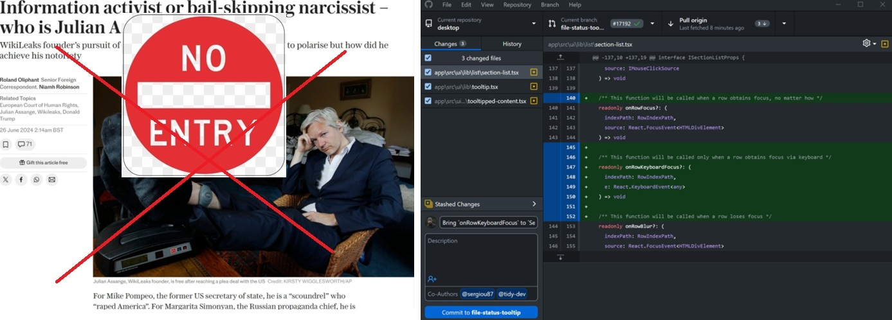

# demo_public_repo
This is a Temp Demo Public Repo - Just to Explain the Fact that - My (Ash Cunard's Personal Repo can be used to Prevent Serious Issues like 'Wikileaks')

 

	Since the time, i started My Journey to make a Career into Active Politics in DC, White House, under Sir President Trump; I have always been Astonished by the Fact that -- Even though there are great minds in our United States but then still Why on Earth, for many Historical problems, if i dig out the History, just for the sake of the discussion, Then Why All Behave Like Absolute Stupids? Absolute Crazy Madness everywhere?? - the reason i say this because in Computer Science, given a problem we come up withn a solution. When i look at News which such event drags on for decades, with such a high severity; then i really wonder - "Man, Give me a problem then i will give you a solution, this whatever is going on, is not a problem to begin with."

	Taking "Wikileaks", e.g., To Prevent it happening ever again, is Simple - Use My GITHub Personal Repo. Thats it So Simple, yet Highly Secure, yet Tight Fine Grained Access Control that too I will decide to whom to Give Access But At the Exact same time, this particular one, is just a public domain. So in short, lot of flexibility to support a variety of use cases including Unlimited Storage Space with Very Reasonable and Affordable Subscription (even by default, its way More than - So even Subscription is just Never needed). If you want to listen further, the list goes on, It's a Product of a Extreme CS Engineering yet very simple to end user!!

	
	
&nbsp;&nbsp;

	

